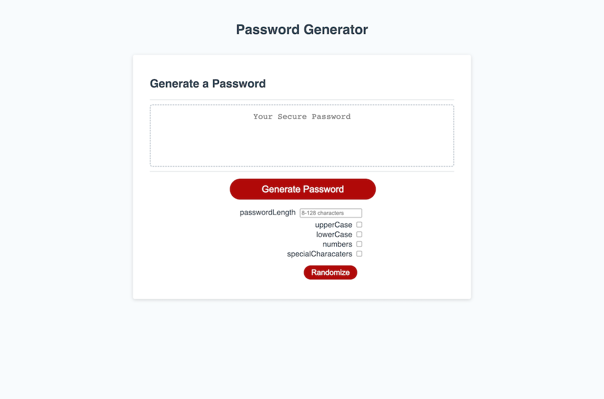

# Random Password Generator

## Description

This project was for the purpose of learning how to generate random values and filter the generated value based on certain criteria.

If you're having trouble thinking of a password then this application is for you!

This random password generator is designed to generate a random password based on 5 criteria.
    - Password length (8-128 characters)
    - Uppercase letters
    - Lowercase letters
    - Numbers
    - Symbols

## Usage

To use the random password generator is very simple.

### First click on Generate Password

This will open up the section to select the password filters.

### Select your desired filters

1. Enter a password length (A numerical value from 8 - 128)
2. Select which filters you would like to include your randomly generated password (At least one must be selected)
3. Click "Randomize"
4. Copy/Paste your newly generated password! (Don't forget to save it somewhere!)

## License

MIT License

Copyright (c) 2023, Adrian Acosta

Permission is hereby granted, free of charge, to any person obtaining a copy
of this software and associated documentation files (the "Software"), to deal
in the Software without restriction, including without limitation the rights
to use, copy, modify, merge, publish, distribute, sublicense, and/or sell
copies of the Software, and to permit persons to whom the Software is
furnished to do so, subject to the following conditions:

The above copyright notice and this permission notice shall be included in all
copies or substantial portions of the Software.

THE SOFTWARE IS PROVIDED "AS IS", WITHOUT WARRANTY OF ANY KIND, EXPRESS OR
IMPLIED, INCLUDING BUT NOT LIMITED TO THE WARRANTIES OF MERCHANTABILITY,
FITNESS FOR A PARTICULAR PURPOSE AND NONINFRINGEMENT. IN NO EVENT SHALL THE
AUTHORS OR COPYRIGHT HOLDERS BE LIABLE FOR ANY CLAIM, DAMAGES OR OTHER
LIABILITY, WHETHER IN AN ACTION OF CONTRACT, TORT OR OTHERWISE, ARISING FROM,
OUT OF OR IN CONNECTION WITH THE SOFTWARE OR THE USE OR OTHER DEALINGS IN THE
SOFTWARE.